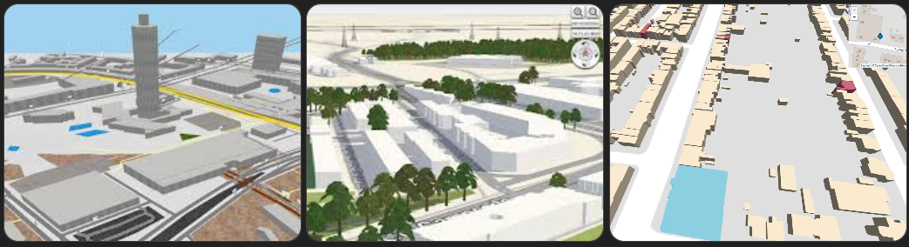
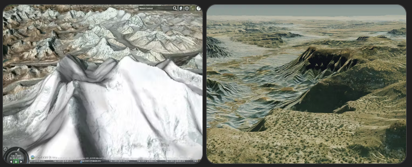
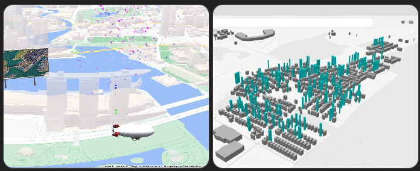
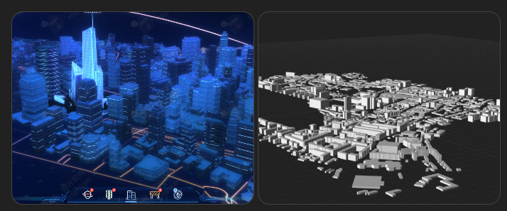

# 3D-map-sample

## 実行方法

- `npx serve <your_file.html>`

## 調査結果

- OpenLayers単体では3Dマップ描画はできないが、3Dライブラリと連携することは可能
  | ライブラリ | 内容 |
  | --------------------- | ------------------------ |
  | Three.js | 地図の上に3Dオブジェクト |
  | CesiumJS | フル3D地球 |
  | deck.gl | WebGLベース3Dレイヤ |

- 特に有名なのはCesiumJS
  - OL-CesiumというOpenLayers向けのプロジェクトがある

- ゼロから作るなら別ライブラリ推奨
  - CesiumJS
  - Mapbox GL JS
  - deck.gl

- 一概に3Dマップと言っても、色々あるのでどんな地図が作りたいかによる
  - 建物が立つ3D地図
    - 
    - 地図の上に建物ポリゴンを高さ付きで表示
    - 都市の建物がブロック状に立つ
    - よく使われる技術
      - Mapbox GL JS
      - Three.js
      - OpenLayers + WebGL
  - 地形付き3D (Google Earthに近い)
    - 
    - 地形（DEM）を使って山・谷・地形を立体表示
    - Google Earthのような支店移動が可能
    - よく使われる技術
      - CesiumJS
      - NASA WorldWind
    - [Sample](https://sandcastle.cesium.com/?id=terrain)
  - 3Dデータ可視化
    - 
    - 地図の上にデータを3Dグラフとして可視化
      - 人口・交通量・売上・IoTデータ等
    - よく使われる技術
      - deck.gl
      - Kelper.gl
      - Three.js
  - 3D都市モデル (PLATEAUなど)
    - 
    - 建物・道路・橋・樹木などを本物に近い3Dモデルで再現 (Project PLATEAUが代表例)
    - よく使われる技術
      - CesiumJS
      - 3DCityDB
      - Unity
